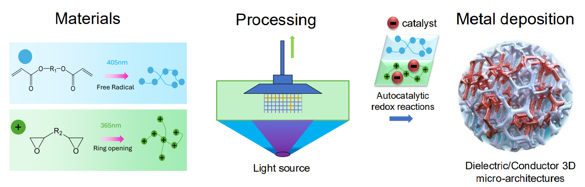
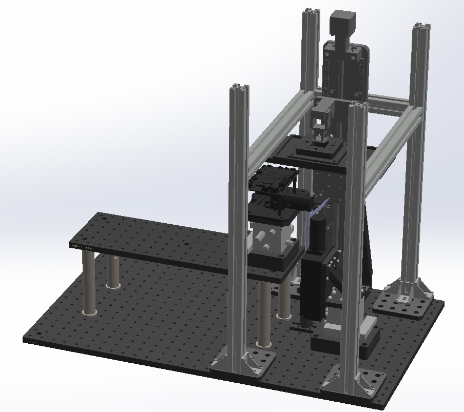
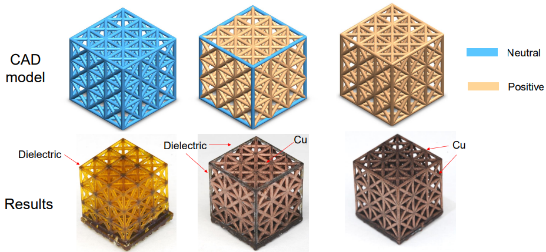
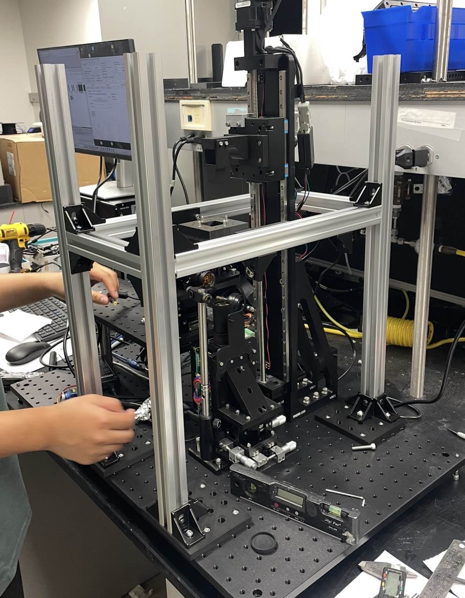
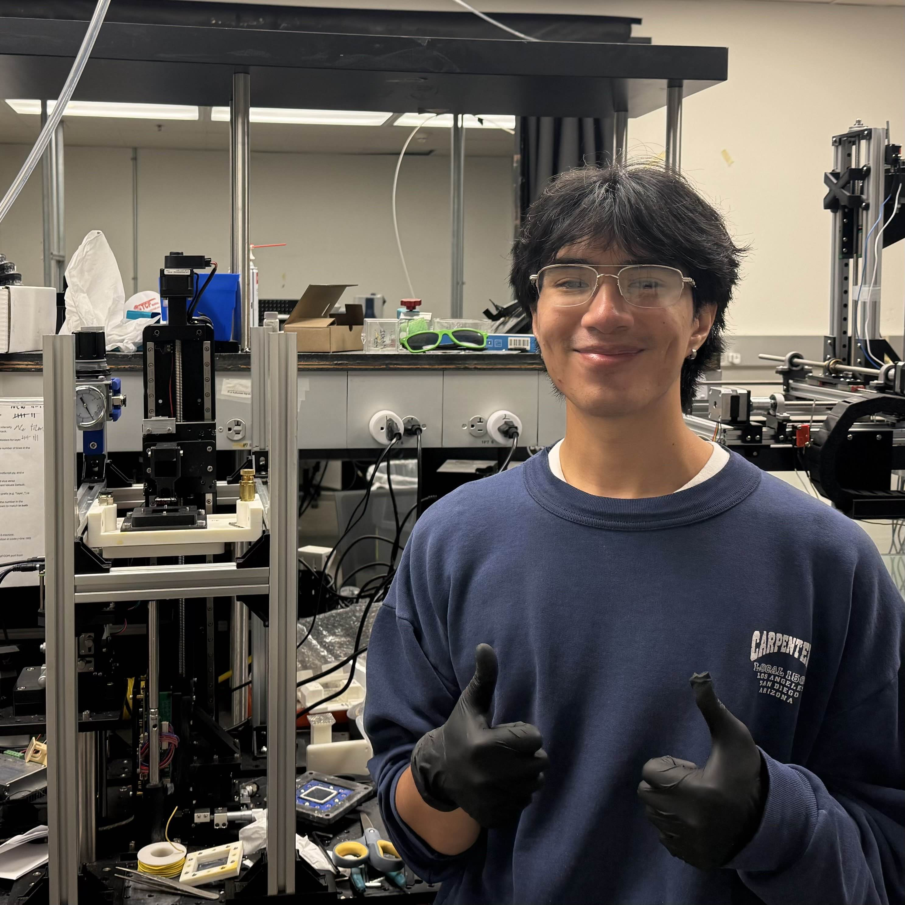

# Undergraduate Researcher - Mechanical Design
**Additive Manufacturing and Metamaterials Laboratory (AMML)**  
**UC Berkeley** | *May 2024 – December 2024*

---

## Overview  
During my time at the **Additive Manufacturing and Metamaterials Laboratory (AMML)**, I focused on advancing additive manufacturing by designing an innovative **DLP multi-material 3D printer** that utilized **dual projection** to cure resins at two different wavelengths. This printer was instrumental in testing various resin formulas and mixtures to identify the optimal combination for the development of **electroless copper plating** on intricate resin prints. Its ability to print multiple microlattices simultaneously highlighted its efficiency and potential for producing complex multi-material prints. 

*Current methods* for electroless copper plating on 3D-printed components *require material changes*, including *cleaning processes*, between each layer as the part is transferred between vats. Some of these cleaning methods are also *harmful to the cured resin*, causing *brittleness* and *compromising the structural integrity of the print*. This results in a highly *time-consuming* and potentially *damaging* process. 

### Dual-Wavelength 3D Printing
**Our novel approach addresses these inefficiencies** by utilizing two distinct polymerization mechanisms—ring-opening polymerization and free radical polymerization—each activated by a **different wavelength of light**. This innovative method **eliminates the need for material change processes**, significantly **accelerating the overall printing speed** while preserving the structural integrity of the printed components. The following diagram provides an overview of our printer's operation:

  

## Key Contributions  
My main responsibilities included using **SolidWorks** to design the entire assembly of the printer and oversee its fabrication. I conceptualized and prototyped modular vats, printheads, mounts, and other interchangeable components to ensure ease of use and adaptability. With access to several commercial 3D printers in our lab, I was able to test various parts extensively. This project also enhanced my skills in testing for tolerances and designing parts that were both easy to assemble and structurally robust. 

**CAD Assembly:** 

  

 

### Print Samples

To identify the **optimal resin ratios** for copper plating, we aimed to maximize testing efficiency and produce as many samples as possible. We focused on printing **two distinct types of samples**: a small **microlattice** to assess the **selectivity and conductivity** of the copper deposition, and a **3x3 pillar cube** to evaluate the **surface finish** of the copper plating. The resin mixture was not the only factor we considered as **curing time** also played a critical role in determining the **quality** of our samples. Through iterative testing, we optimized the curing times to achieve the best possible results.   

  

**Final Product**

  
  

---

## Skills & Tools  
- **Software Proficiency:** SolidWorks, MATLAB, Arduino.  
- **Lab Equipment:** 3D printers, ovens, and precision measurement tools.  
- **Materials Expertise:** Worked with hazardous materials, ensuring safety and compliance.  

