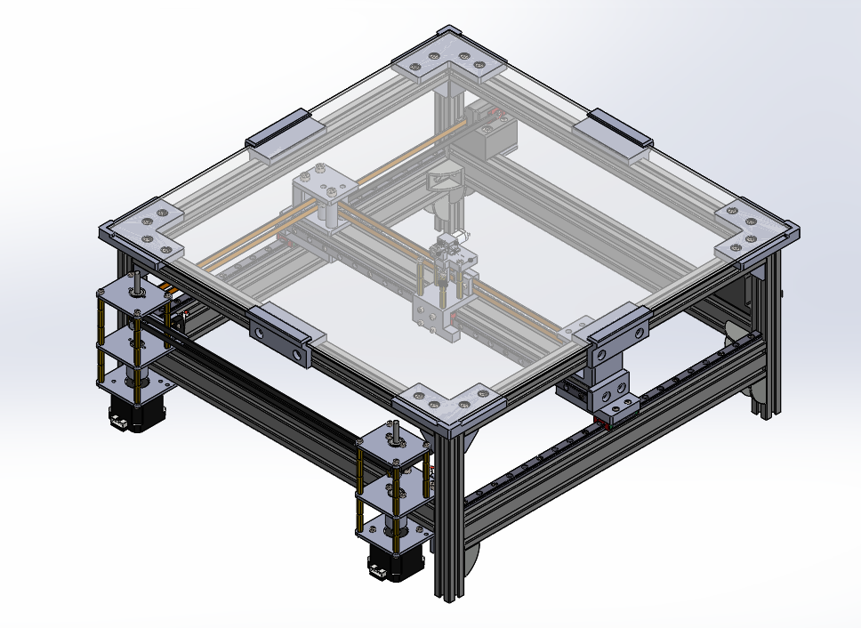
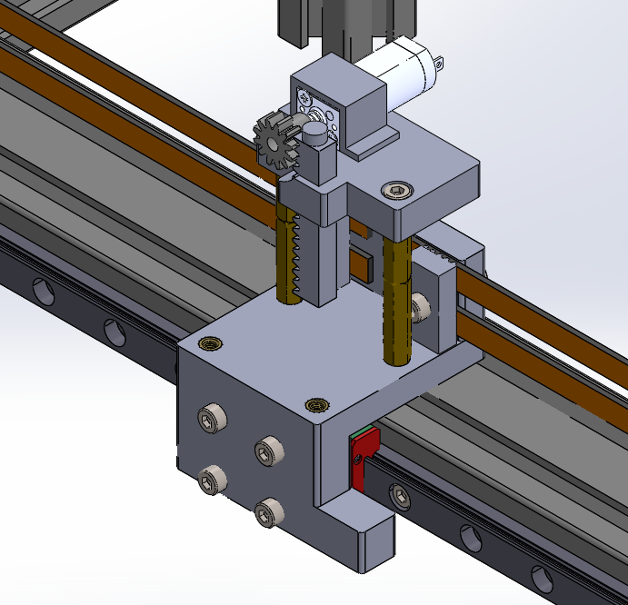
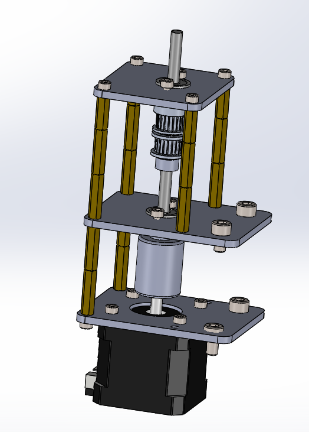

# Automatic Chessboard: IntelliChess
**Class: Introduction to Mechatronics**  
**UC Berkeley** | *August 2024 – December 2024*

---

## Overview 
In our Introduction to Mechatronics class, we were given the creative freedom to design and fabricate a **mechanical system** incorporating **motors** and integrated circuits. As a group of chess enthusiasts, we decided to challenge ourselves by creating an **automatic chessboard** that allows two players to compete without physically moving the pieces. The only input required from the players is their desired move in standard chess notation (e.g., A2 → A3).

Our high-level strategy involved designing a **2-axis gantry** system capable of moving a **magnet** beneath an acrylic chessboard to manipulate the pieces. For this project, I was responsible for the mechanical design and fabrication of the entire system, ensuring precision and functionality throughout the development process.  

## Key Contributions
In this project, I took full responsibility for the **mechanical design and fabrication** of the entire system. This involved extensive CAD modeling in **SolidWorks**, where I finalized the design to ensure precision and functionality. Additionally, I created a **Bill of Materials (BOM)** and managed the outsourcing of components to meet project requirements. I also had the task of **water jetting** the 1/8" aluminum sheet metal for our motor housing. Countless hours were dedicated to **prototyping** 3D printed parts to test fits, tolerances, and overall system performance, ensuring a robust and reliable final product.

### Finalized CAD Model

  

  
  

### Key Features and Design Elements
- **Custom Chess Pieces:** Each chess piece was 3D-printed and embedded with a magnet at its base, enabling interaction with the gantry system’s main magnet.

- **Acrylic Chess Board:** We selected an acrylic sheet as the base and laser-etched a chessboard pattern onto its surface. This provided a sleek, durable playing surface while allowing the magnet to move freely underneath.    

- **2-Axis Gantry System:** The gantry system was designed to move the main magnet in the X and Y directions with a travel distance of at least 300mm in both axes. This exceeded the chessboard’s dimensions (~250mm x 250mm) to accommodate a designated “trash bin” area for captured pieces. 

- **Rack and Pinion on Gantry w/ Main magnet:** The rack and pinion mechanism, integrated into the gantry, managed the vertical motion of the main magnet. When a player input a move, the gantry aligned the magnet below the selected chess piece, activated the magnet to lift it, translated it to the target position, and then deactivated the magnet to release it. In cases where a piece needed to be captured, the system would first relocate the opposing piece to the designated trash bin area before completing the player’s move.

- **Stepper Motors and Drive Components:** Stepper motors powered the gantry system, while belts, pulleys, idlers, and tensioners ensured smooth and precise movement. To ensure robustness and rigidity, the stepper motors were housed in custom enclosures made from 1/8-inch aluminum plates. These enclosures were designed to securely hold the motors in place while maintaining a clean and organized overall design. The combination of 3D-printed components and aluminum plates provided the necessary durability to support the system’s precise movements and long-term functionality.

Our project was a huge success at our final showcase, as multiple people were able to play full chess games with each other as others watched.

  <video style="height: 450px; width: auto;" controls autoplay loop muted>
    <source src="assets/IMG_3129.mov" type="video/mov">
    Your browser does not support the video tag.
  </video>

## Skills & Tools  
- **Software:** SolidWorks, Python, Google Sheets.
- **Equipment:** 3D printer, Water jet, Soldering Iron, Stepper Motors. 