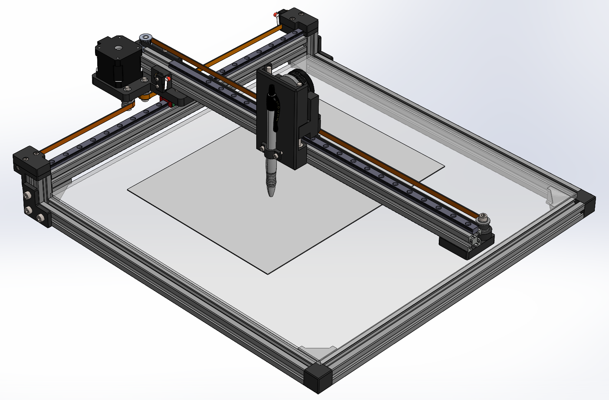

# CNC Plotter: Sketch Bot (IN PROGRESS)
**Personal Project**  
**Home** | *March 2025 – Present*

---

## Overview 

This project involved the end-to-end development of a CNC plotter capable of drawing precise patterns and designs using a mounted pen. I designed the entire mechanical assembly in SolidWorks, integrating components such as stepper motors, linear rails, and structural supports. I also handled the electronics, including motor drivers and microcontroller integration, to ensure accurate motion control. After compiling a detailed Bill of Materials (BOM), I sourced all components and assembled the device using various tools and fabrication techniques. The final system successfully translated digital designs into physical sketches with high precision.

  

