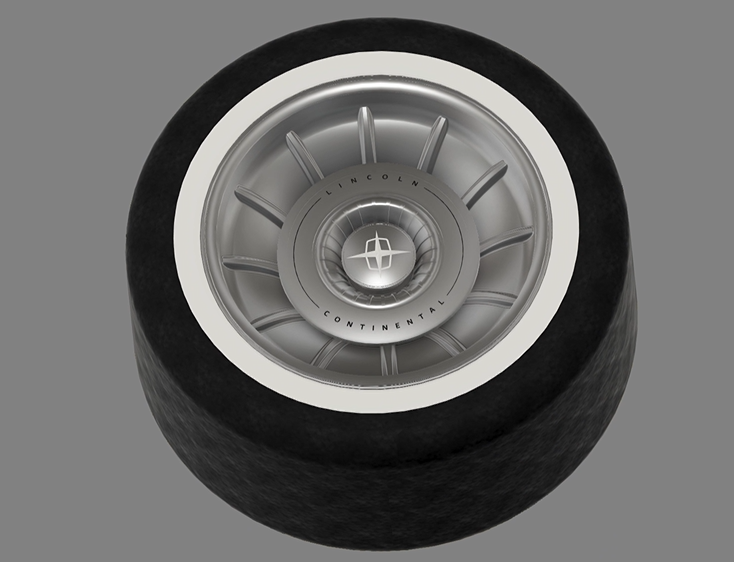
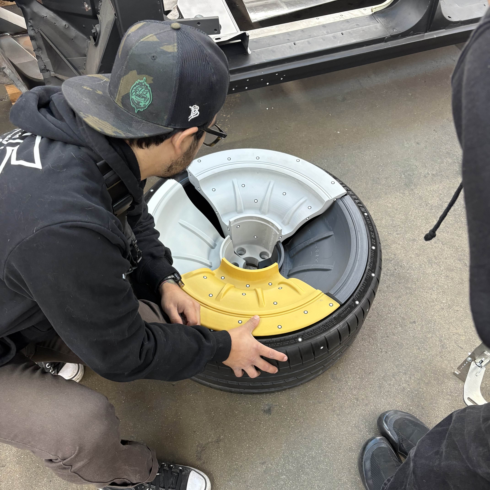
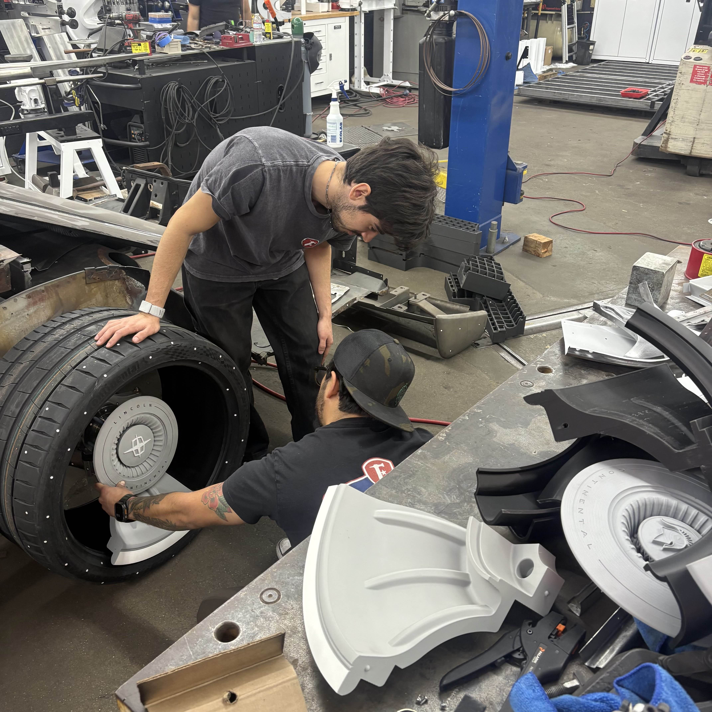
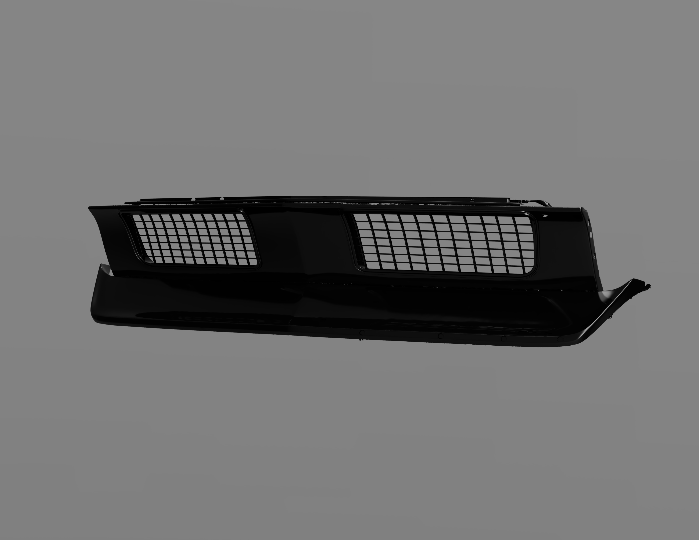
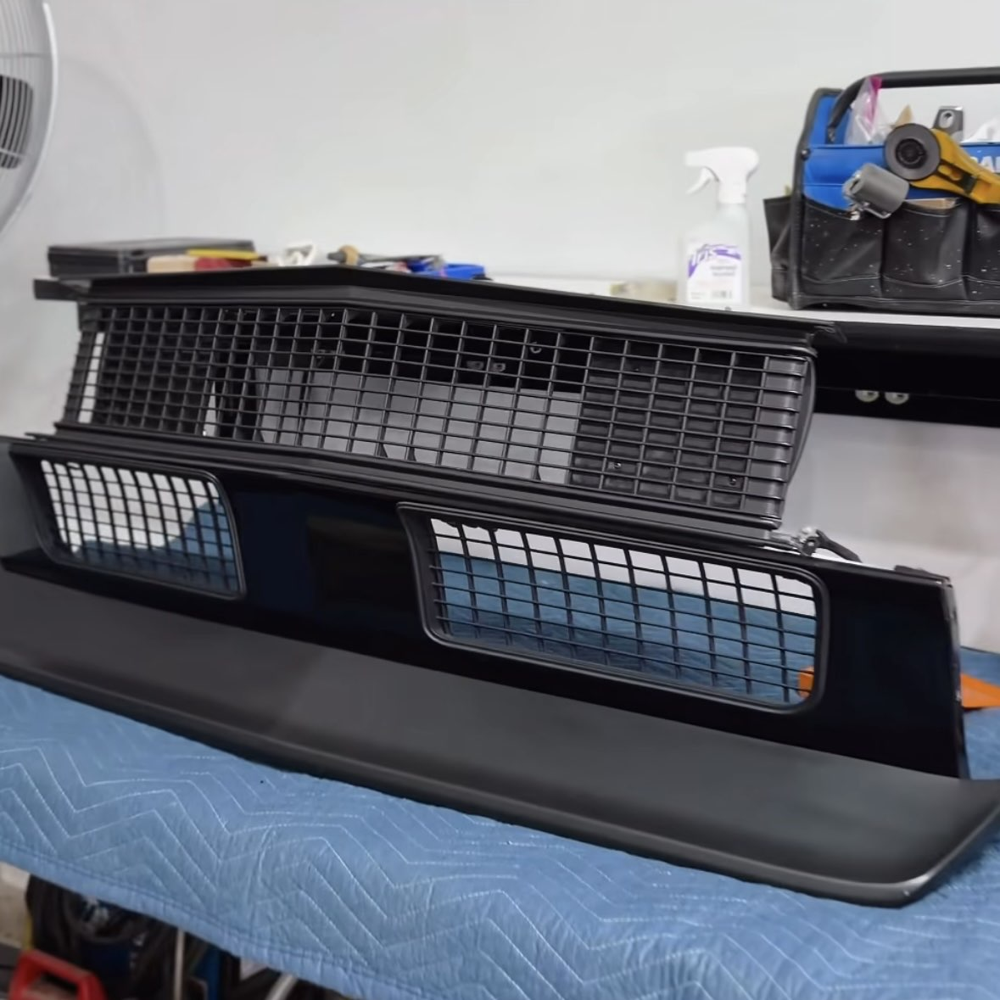
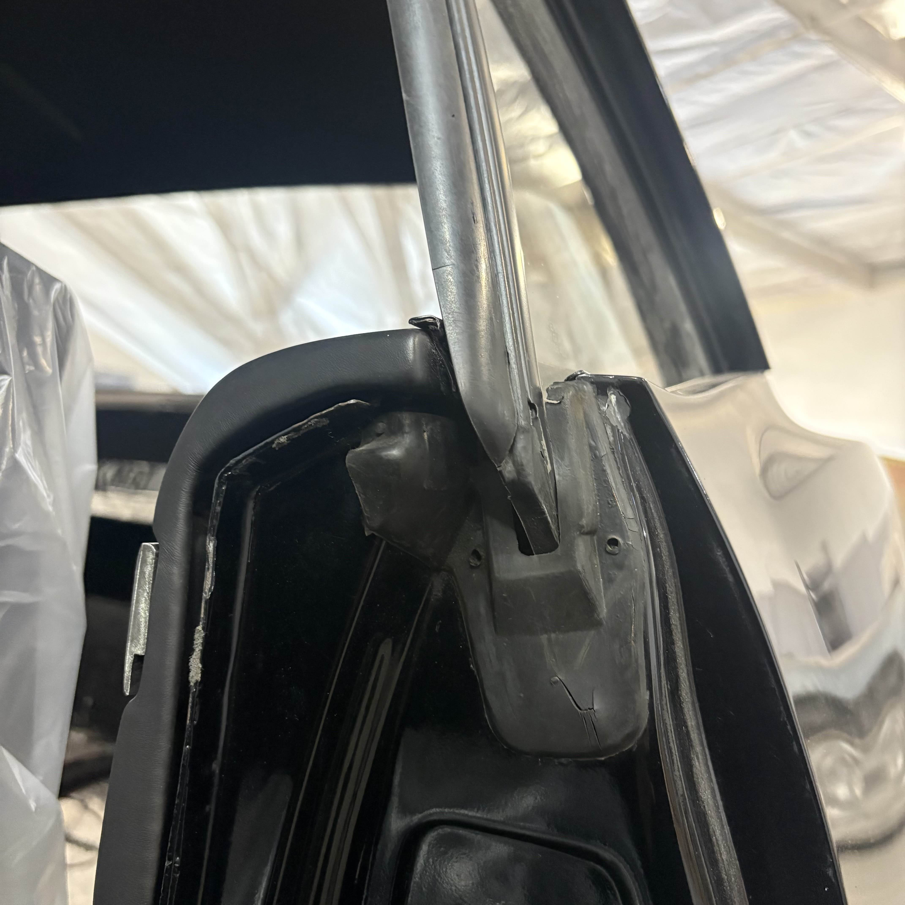
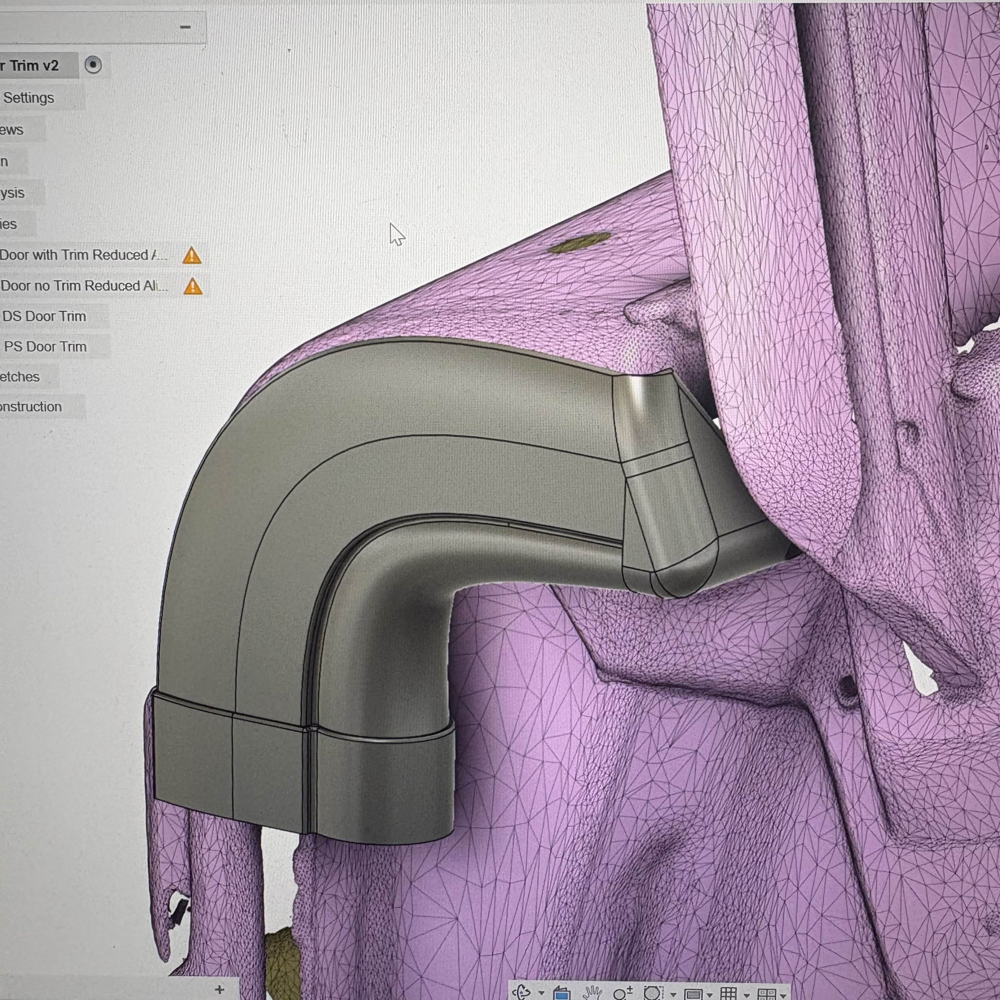

# Fierro Fab - Mechanical Engineer I
**San Pedro, CA** | *April 2025 – {Present}*

---

## Overview  
As a Mechanical Engineer at Fierro Fab, I've had the opprtunity of working on an exciting restoration project involving several 
1965 Lincoln Continentals. My work at Fierro Fab bridges physical fabrication and digital design, enabling higher accuracy, repeatability, and reduced fabrication time. As the company is in its early stages of being a startup, I am deeply involved in a wide range of 
projects and collaborated closely with fabricators, designers, and engineers from diverse backgrounds. 

## Main Resposibilities: 
1. Designed and built custom dies, fixtures, and bucks to support the forming and restoration of sheet metal components. 
2. Utilized 3D scanning software and equipment to reverse engineer and redesign automotive parts for repair and reproduction. 
3. Surface modeled different car panels and parts using referenced scanned mesh data in Autodesk Fusion and QuickSurface.
4. Operated and managed 3D printers and laser cutters to produce and refine prototypes for various mechanical parts. 
5. Checked clearances for newly added components and structural modifications, and recommended design changes when needed.

## Fender and Body Panel Restorations:

One of my primary responsibilities was prototyping custom **dies and bucks** to improve the efficiency and accuracy of metal shaping. With multiple Lincoln restorations and mirrored driver and passenger side components, these tools helped **maintain accurate geometry, streamline fabrication, and ensure consistency across parts**.

Work Flow:

Identify problem → 3D scanning → Surface Modeling in AutoDesk Fusion → CAD → 3D Printing → Final Product

## Wheel Hub Design

I was responsible for designing a **custom wheel hub** for the Lincoln based on an initial render provided by the industrial engineer that we work alongside with. The design process required careful consideration of **mechanical fitment**, including interface with the brake rotor and clearance for the brake calipers. **Multiple design iterations were explored**, evaluating wheel thickness and integrated whitewall proportions. The final concept recreated the classic whitewall aesthetic by incorporating it directly into the rim design rather than the tire itself. I designed the wheel hub in Fusion and 3D printed sections of different variations of the wheel. 

  

  
  

## Supporting Projects & One-offs:

### Custom Grille
Another project involved designing **custom lower grilles** for a classic **1968 Camaro** car model. The design required careful **integration and mounting** with the existing front body panels and **visual alignment with the upper grille**. Using Fusion, I designed both driver and passenger side grilles and tested fitment through 3D-printed prototypes. A key challenge in this project was that the pre-existing left and right openings of the front of the Camaro were not perfectly symmetric, requiring two distinct designs to achieve proper fitting.

  
  

  

### Fierro Fab Press Brake 
I was tasked with designing a custom 50" press brake for our shop. The design incorporated sheet-metal drawers engineered to support the weight of the press brake fingers and stamping tools, providing organized storage while maintaining structural integrity under load. 

### Custom Gasket Trim

For the same Camaro I designed the lower grilles for, I also created custom gasket trim for the interior door panels. The stock trim had rough edges and did not taper cleanly, so I was tasked with designing a piece that would both conceal the unfinished area and provide a smooth, finished appearance. Similar to the original gasket, we produced the part using matte TPU, allowing it to flex and conform precisely into the intended slit.

  
  

  

