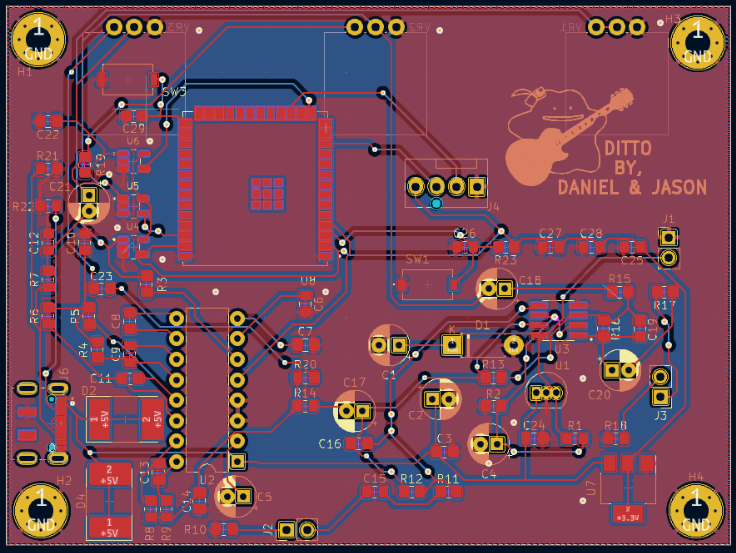
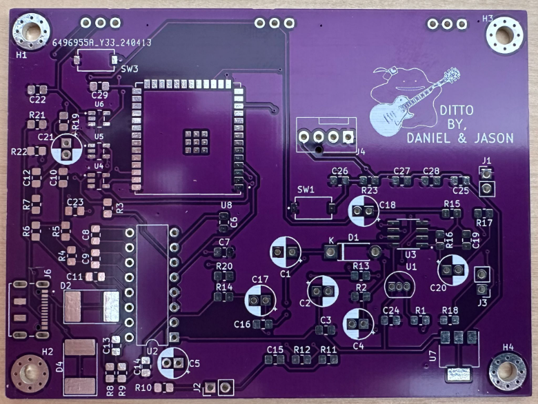
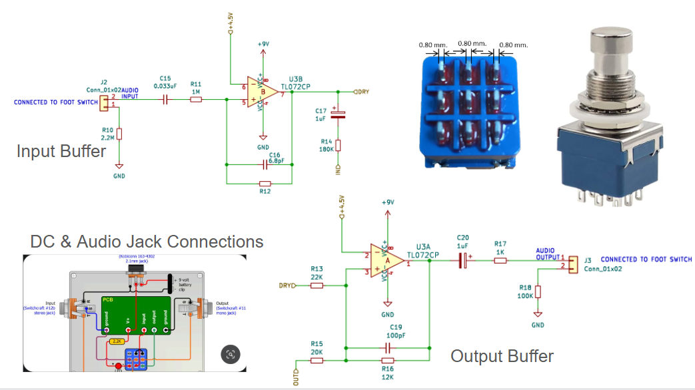
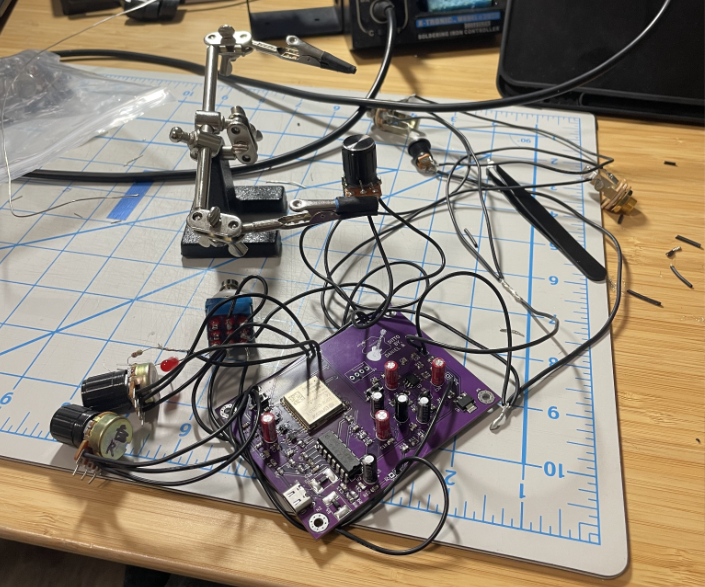
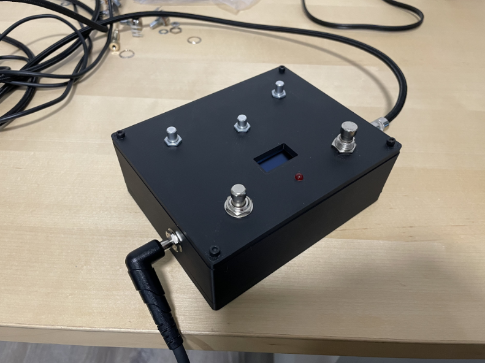

# Delay & Reverb Guitar Pedal: Ditto
**Class: Hands-On-PCB Engineering**  
**UC Berkeley** | *February 2024 – May 2024*

---

## Overview 
In this introductory PCB course, I was tasked with designing and fabricating a printed circuit board (PCB) with a practical function. Using **KiCAD**, I learned to create **schematics and PCB layouts** digitally before having the board fabricated and assembling the circuit components through **soldering**. My lab partner and I decided to design a **delay and reverb guitar pedal PCB**, aiming to enhance guitar performances with unique **audio effects**.

The pedal’s primary function was to **delay audio signals**, creating repetitive playback that gradually faded over time, while also adding **reverb** to simulate an **artificial ambience**. As a hidden feature, we incorporated a **self-oscillation** mode, which increased signal volume and introduced **distortion** over time—essentially the opposite of the delay effect. This added a creative twist for experimental sound manipulation.

## Key Contributions
Using **KiCAD**, I designed and modeled a printed circuit board (PCB) by applying foundational circuit knowledge. Starting from scratch, I manually created schematics that successfully passed the **Design Rule Check (DRC)**, ensuring electrical and mechanical integrity. Components were strategically placed to optimize space, improve signal flow, and enhance overall efficiency, resulting in a well-organized and functional PCB design.

### PCB Layout 

  
  

### Example Schematics

  

  

### Key Features and Design Elements
- **Custom Guitar Pedal Enclosure:** To house all the components, including the PCB, knobs, switches, LCD screen, and audio jacks, we designed and fabricated a custom guitar pedal enclosure. The enclosure was toleranced to ensure a perfect fit for all internal components while maintaining a sleek and professional appearance.

- **Three Knobs/Potentiometers:**  The guitar pedal featured 3 main knobs
**Level:** Adjusted the volume of the delayed signals.
**Time:** Controlled the interval between each repeated signal.
**Repeat:** Determine the number of repetitions before the signal faded out.

- **Two Foot Switches:** A simple on/off switch to control the circuit’s power. Soft foot switch that activated the self-oscillation feature for experimental sound effects.

- **LCD Screen:**  Displayed the waveform of the audio signal, providing visual feedback for the user.

### Internals and Final Product

  
  

This project allowed us to apply our newfound PCB design skills while exploring the intersection of electronics and music. The final product was a functional and creative guitar pedal that demonstrated our ability to integrate circuit design, component selection, and user interface considerations into a cohesive and practical device.

## Skills & Tools  
- **Software:** KiCAD, Arduino, Google Sheets.
- **Equipment:** Soldering iron, 3D Printer.

