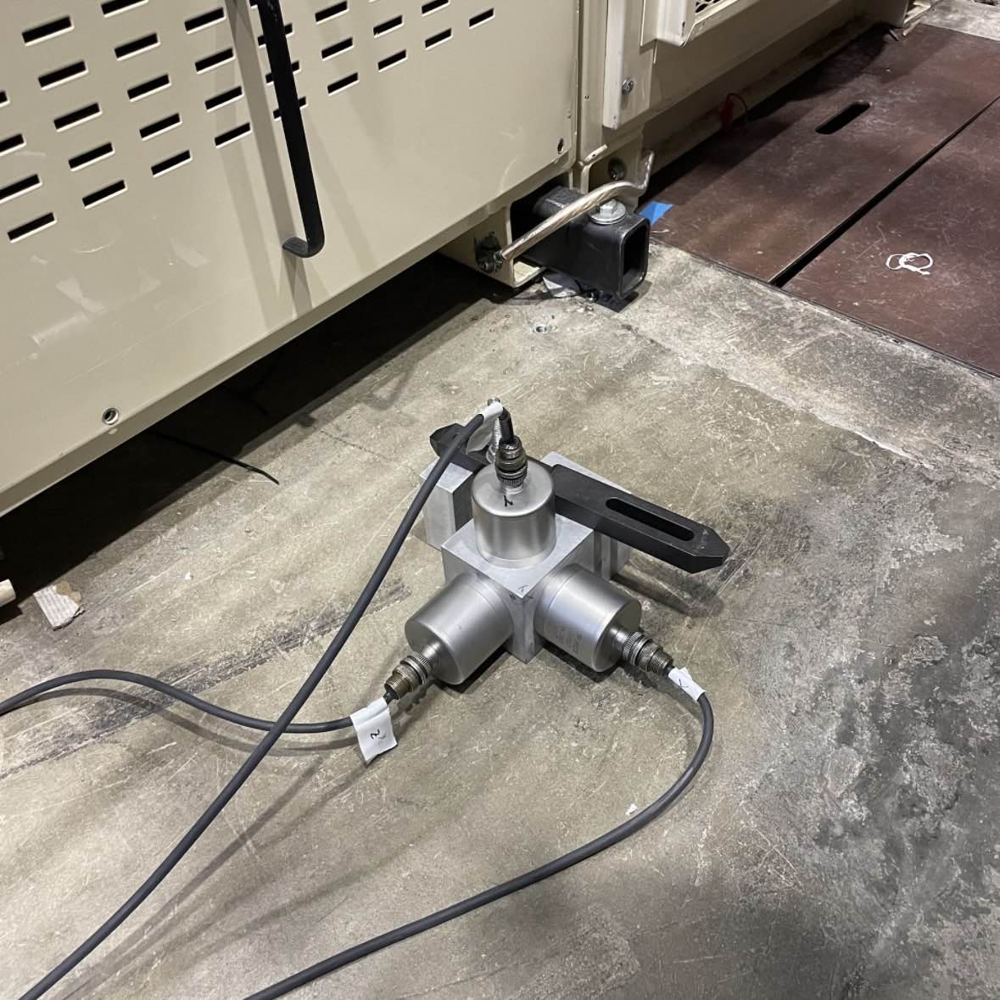
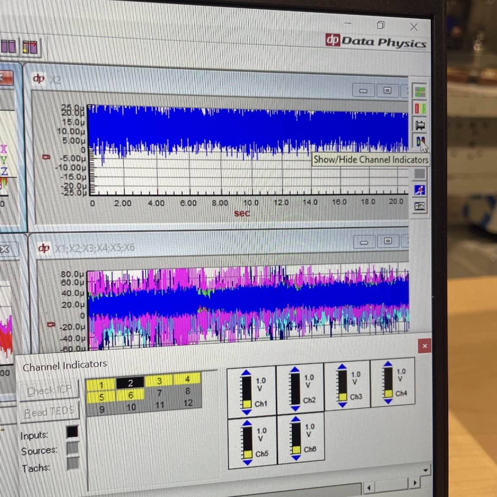
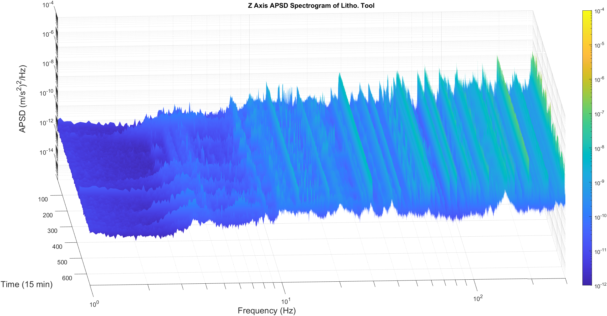
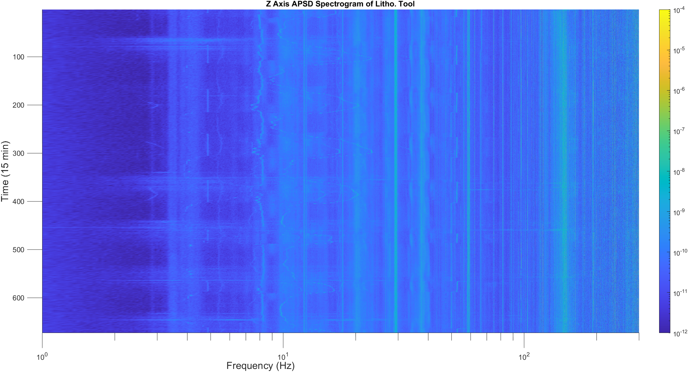

# Undergraduate Researcher - Instrumentation and Measurements
**Lawrence Berkeley National Laboratory (LBNL)**  
**UC Berkeley** | *May 2023 – August 2023*

---

## Overview  
During the summer of 2023, I had the privilege of working at the **Lawrence Berkeley National Laboratory (LBNL)**, one of Berkeley’s most prestigious research facilities. As part of the **Optics Sector**’s initiative to identify a suitable location for a new microchip printer, I was tasked with **measuring vibrations and resonant ground frequencies** in the proposed area. Collecting this data was critical for the engineering team, as understanding these frequencies is essential to **mitigating vibrations** that could compromise the precision required for microchip fabrication. This challenge was particularly significant given the sector’s proximity to the **Advanced Light Source (LBNL’s particle accelerator)**, a nearby machine shop, and a high-foot-traffic area, all of which posed **potential sources of interference**.

## Key Contributions 
To **measure ground motion** within the lab sector, I utilized **seismic accelerometers** connected to a **data acquisition system**. This setup allowed me to capture and **analyze vibration frequencies** accurately. Additionally, I became proficient in using **Data Physics** software, which played a critical role in collecting data from the sensors, organizing it into files, and enabling further analysis and configuration. Using **MATLAB**, I processed the collected data by applying **Fast Fourier Transform (FFT)** algorithms to analyze the frequency spectra. This allowed me to visualize and interpret the data in a meaningful way, providing the engineering team with insights to effectively **dampen and mitigate the unwanted vibrations**. 

### Accelerometer Setup and Data Acquisition

  
  

The experimental setup comprised **three seismic accelerometers** securely mounted onto a precision-machined metal block, with each accelerometer aligned to **measure displacement along the X, Y, and Z axes**, respectively. These sensors were connected to a data acquisition system to capture vibration data. Using Data Physics software, the raw acceleration data was collected over user-defined intervals, processed, and averaged to generate the outputs. The raw data, initially provided in units of *g/s*, was challenging to interpret in its unprocessed form. To analyze the data more effectively, MATLAB was employed to perform a **Fast Fourier Transform (FFT)**, converting the time-domain signals into the frequency domain. This allowed the data to be represented as **Acceleration Power Spectral Density (APSD)** plotted against **frequency (Hz)**. For extended data acquisition periods, such as week-long recordings, the data was also visualized as a **spectrogram**, incorporating time as an additional dimension. This provided the engineering team with valuable insights into the temporal variations in **vibration patterns**, particularly in identifying prominent vibrations occurring at different times throughout the day and night. An example of this analysis is illustrated in the spectrogram generated from a one-week recording conducted adjacent to a lithography machine in the sector:

: 

  

  

**Patterns** and **resonant frequencies** are clearly identifiable in the spectrogram. For instance, a distinct line appearing and disappearing at approximately 4.9 Hz corresponds to the **operational cycles** of the Advanced Light Source (ALS), a particle accelerator at LBNL. This pattern reflects the ALS being powered on during active hours and transitioning to a dormant state during the night. Similar **periodic patterns** are observable at frequencies around 35 Hz and 53 Hz, further corroborating the influence of the ALS on the vibrational environment. Additionally, a subtle, trend near 8.3 Hz is evident, which aligns with the **intermittent operation** of other machinery in the sector throughout the day. These trends provide valuable insights into the temporal dynamics of **vibrational activity** and its correlation with specific equipment usage.

