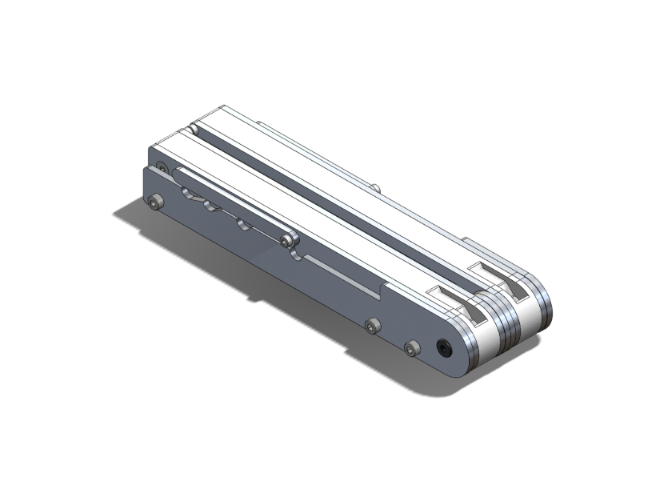
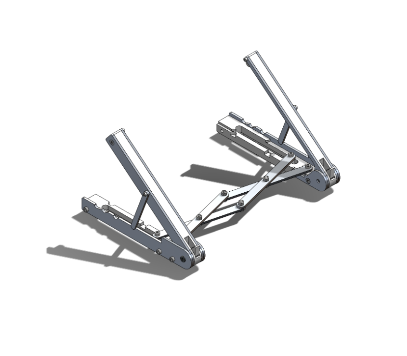

# Adjustable & Collapsible Laptop Stand
**Class: Introduction to Manufacturing and Design**  
**UC Berkeley** | *February 2023 – May 2023*

---

## Overview 
In this course, our team was challenged to design and fabricate an innovative consumer product that addresses a specific problem or need. Our group decided to focus on improving ergonomics by creating a laptop stand that is collapsible for portability, adjustable to accommodate various laptop sizes, and sturdy enough to support even the heaviest laptops or tablets.

## Key Contributions

In this project a partner and I were responsible for designing and refining the original concept’s CAD using SolidWorks as well as water jetting aluminum sheet metal.

### Finalized CAD Model

  
  

### Key Features and Design Elements
- **Cross-Link Mechanism:** This mechanism allows the user to easily adjust the stand to fit their laptop’s length and fold it back into a compact form for portability. The cross-link design ensures smooth operation while maintaining structural integrity.

- **Adjustable Slots**: The stand includes four preset tilt/angle adjustments, enabling users to customize their screen height and angle for optimal ergonomic comfort. These settings cater to both laptop and tablet users, promoting better posture and reducing strain during extended use.

- **Material Selection:** To balance durability and cost-effectiveness, we constructed the stand using 1/8-inch aluminum for its strength and rigidity, combined with 3D-printed PLA components for the housing. We cut the aluminum plate ourselves using our school machine shop’s waterjet. This combination provides the sturdiness needed to support heavy devices while keeping production costs low.

- **Sleek & Compact Design:** We prioritized aesthetics and functionality by designing a laptop stand that is not only visually appealing but also nearly seamless when folded. This ensures a high-quality, modern look while maintaining practicality.

Through this project, we successfully delivered a functional, user-friendly laptop stand that combines portability, adjustability, and durability. It reflects our ability to integrate mechanical design principles, material selection, and ergonomic considerations into a practical consumer product.