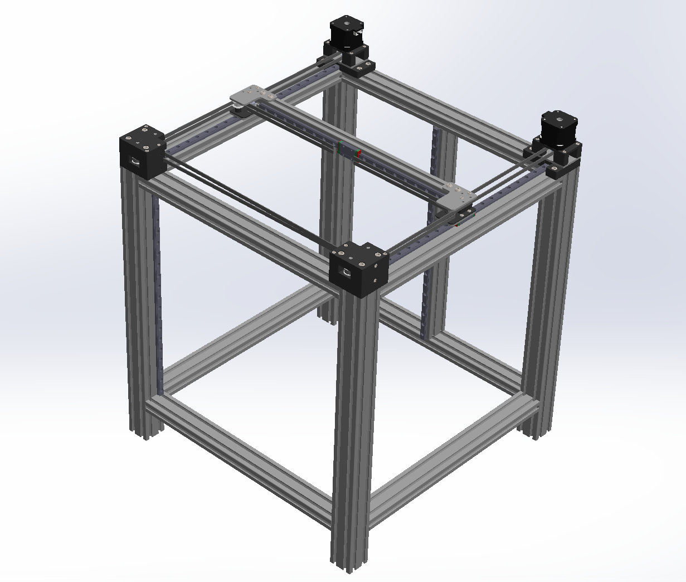

# Personal 3D Printer: XYlopeZ (IN PROGRESS) 
**Home** | *November 2024 – Present*

--- 

## Overview 
Inspired by my experience working in an additive manufacturing lab, I embarked on a personal project to design and build a **custom 3D printer** for myself. My goal is to create a printer with a **large build volume**, capable of matching or exceeding the **speed** of current commercial models, while maintaining **reliable print quality** and a clean, **robust design**. This project serves as an ideal opportunity to apply and expand my skills as a mechanical engineer, as it integrates multiple disciplines, including mechanical design, electronics, heat transfer, kinematics, coding, and more.

Currently, the project is a **work in progress**, with a detailed CAD model in development. Once finalized and after I gain the necessary funding, I aim to bring the design to life. As a recent college graduate with limited resources, this endeavor also challenges me to **balance cost-effectiveness** with the need for a durable, high-performance design—a skill that mirrors real-world engineering constraints. This project not only reflects my technical abilities but also demonstrates my commitment to innovation, problem-solving, and resourcefulness.

**CAD Assembly**:

  

