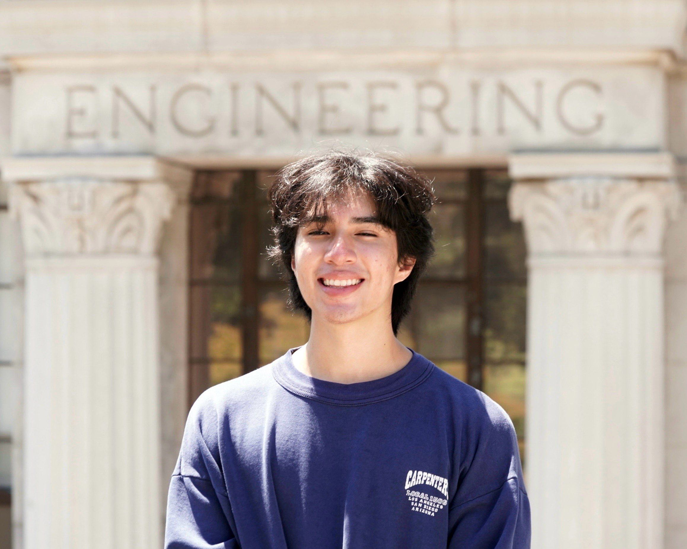
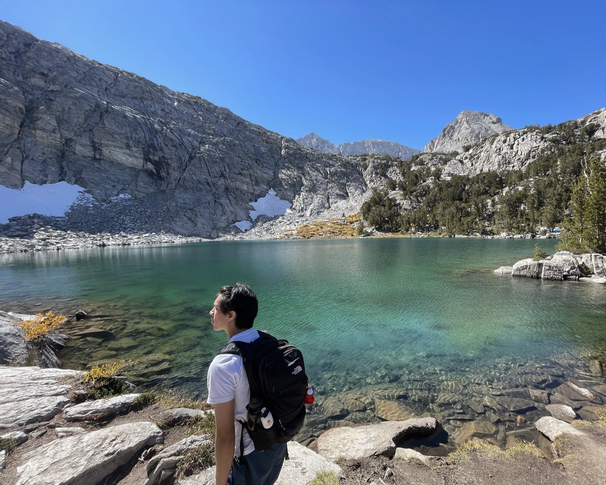
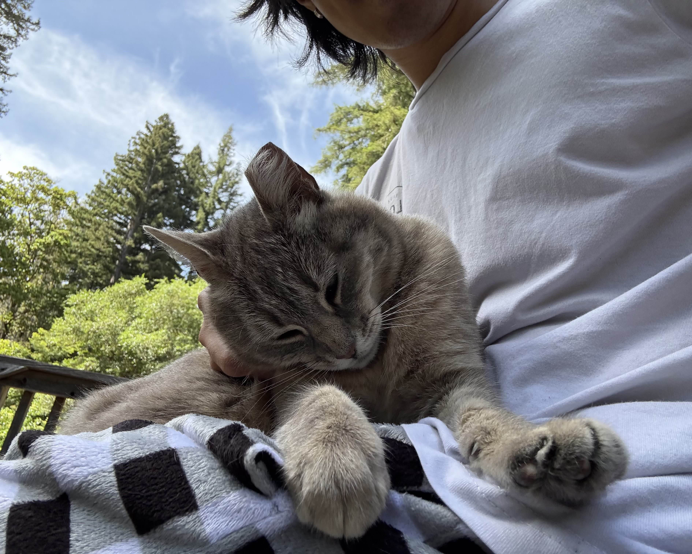
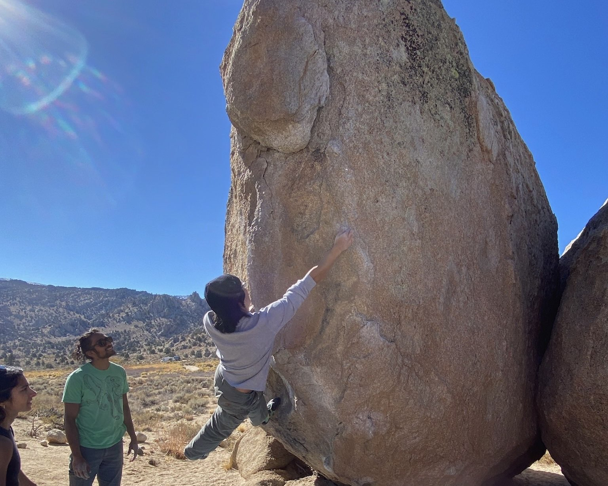

[**Resume (PDF)**](/assets/Lopez_Jason_Resume_01_2026.pdf){: .btn .btn-primary }

About Me
----
My name is Jason Lopez, and I’m a Mechanical Engineer focused on designing products where form and function are inseparable. I enjoy transforming engineering constraints into clean, intentional designs that are both mechanically robust and visually compelling

  
  

  
  

In December 2024, I graduated from the **University of California, Berkeley**, with a Bachelor’s degree in **Mechanical Engineering**, achieving a **GPA of 3.54**. During my academic journey, I had the privilege of gaining hands-on experience at the [Lawrence Berkeley National Laboratory (LBNL)](https://www.lbl.gov/) and the [Additive Manufacturing and Metamaterials Lab (AMML)](https://www.raynexzheng.com/). I currently work as a mechanical engineer at a metal fabrication shop in San Pedro, CA called [Fierro Fab](https://www.instagram.com/fierrofab/?hl=en). There, I tackle the arduous task of restoring a very sought after classic car model, a **1965 Lincoln Continental**.

Beyond work, I enjoy spending my time rock climbing, playing soccer, learning guitar, hiking/backpacking, 3D printing, and working on personal projects.

Please feel free to stick around and explore my page!

