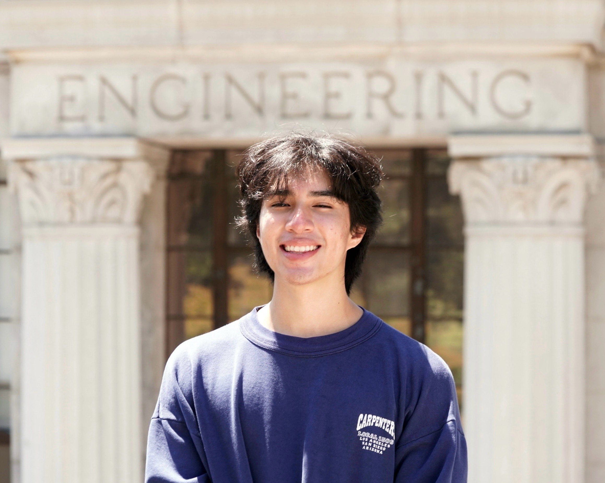
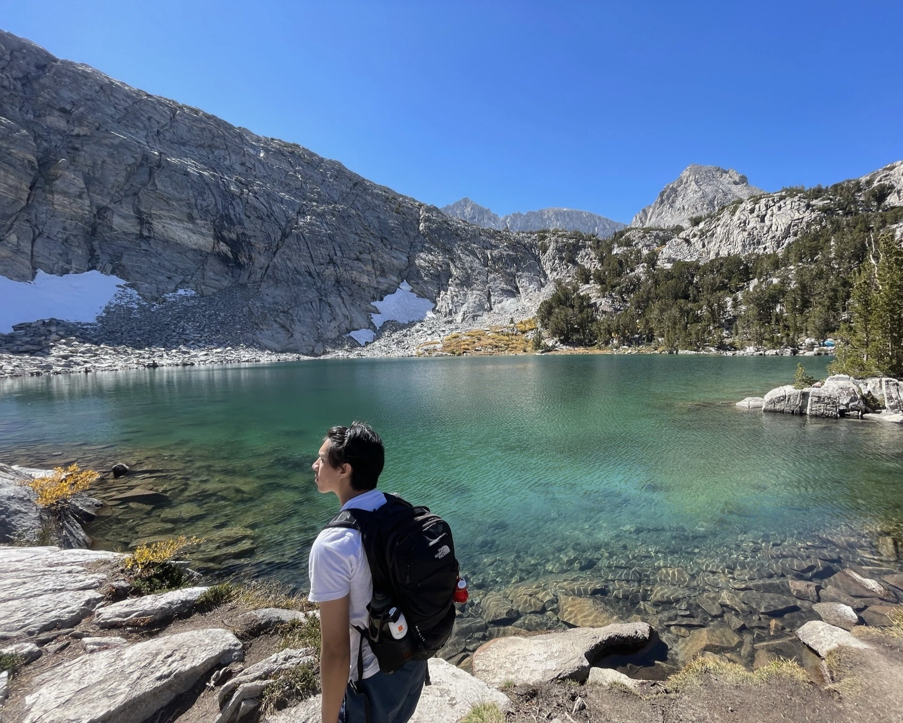
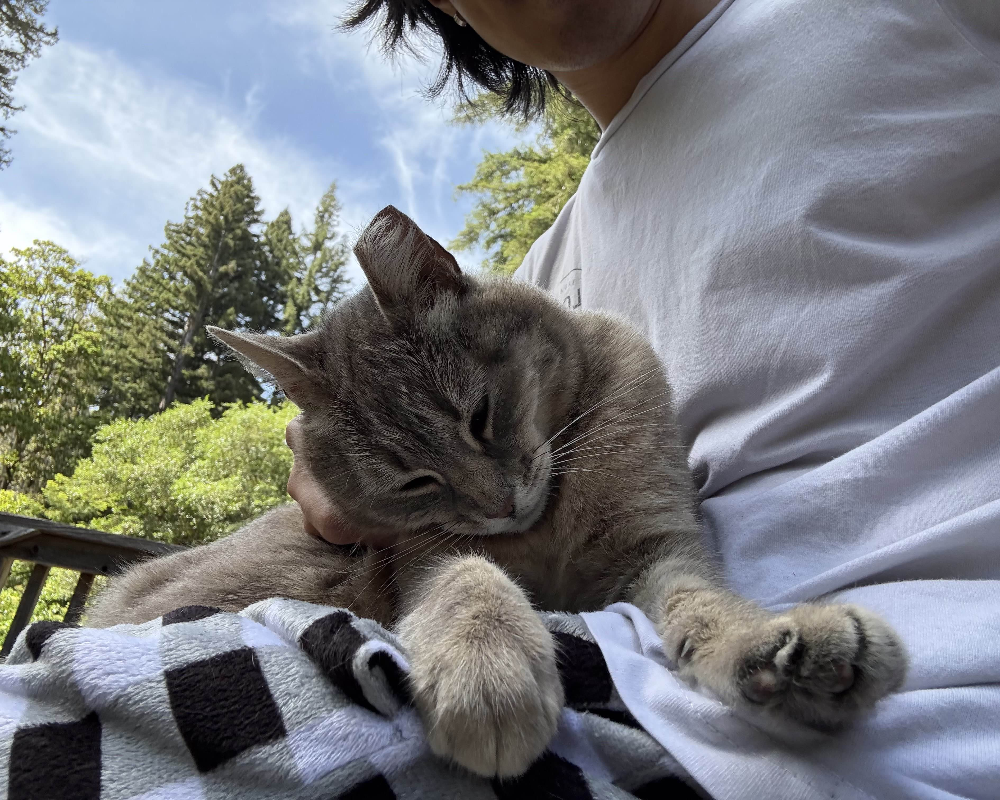
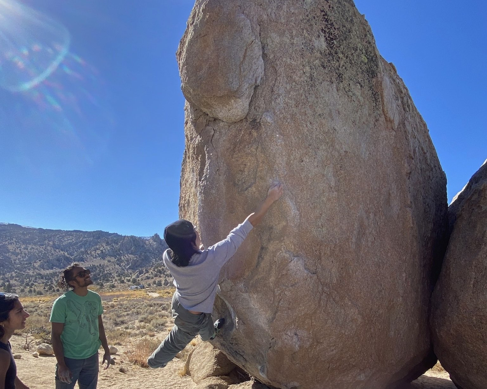

[**Resume (PDF)**](/assets/Jason_Lopez_Resume.pdf){: .btn .btn-primary }
[**LinkedIn**](https://www.linkedin.com/in/jasonkylopez/.html){: .btn .btn-primary }

[**Work Experience**](https://jasonkylopez.github.io/WorkExperience.html){: .btn .btn-primary }
[**Academic & Personal Projects**](https://jasonkylopez.github.io/Projects.html){: .btn .btn-primary }

About Me
----
I'm Jason Lopez, a Mechanical Design Engineer who holds aesthetics and function to the same standard. I care about the details most people overlook, the ones you would only notice if they were wrong. A design isn't done until all of it feels right, even the parts no one can see.

  
  

  
  

In December 2024, I graduated from the **University of California, Berkeley**, with a Bachelor’s degree in **Mechanical Engineering**, achieving a **GPA of 3.54**. During my academic journey, I had the privilege of gaining hands-on experience at the [Lawrence Berkeley National Laboratory (LBNL)](https://www.lbl.gov/) and the [Additive Manufacturing and Metamaterials Lab (AMML)](https://www.raynexzheng.com/). I currently work as a mechanical design engineer at a metal fabrication shop in San Pedro, CA called [Fierro Fab](https://www.instagram.com/fierrofab/?hl=en) where we specialize in restoring and modifying cars. There, I tackle the arduous task of restoring a very sought after classic car model, a **1965 Lincoln Continental**.

Beyond work, I enjoy spending my time rock climbing, playing soccer, learning guitar, hiking/backpacking, 3D printing, and working on personal projects.

Please feel free to stick around and explore my page!

